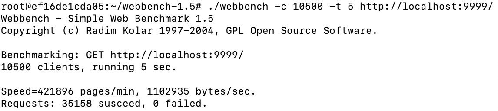

# WebServer
用 C++ 实现的高性能WEB服务器，经过 webbenchh 压力测试可以实现 5000 的 QPS

## 功能
* 利用 IO 复用技术 Epoll 与线程池实现多线程的 Reactor 高并发模型；
* 利用正则与状态机解析 HTTP 请求报文，实现处理静态资源的请求；
* 基于小根堆实现的定时器，关闭超时的非活动连接；
* 使用RAII手法封装互斥器(pthread\_mutex\_t)、 条件变量(pthread\_cond\_t)等线程同步互斥机制
* 使用互斥锁、条件变量实现线程安全的阻塞队列(BlockingQueue)

## 环境要求
* Linux
* C++14

## 目录树
```
.
├── Epoll.cpp  epoll 系统调用的封装
├── Epoll.h
├── HeapTimer.cpp  小根堆实现的定时器
├── HeapTimer.h
├── HttpConn.cpp   管理 http 连接
├── HttpConn.h
├── HttpRequest.cpp  解析 http 请求
├── HttpRequest.h
├── HttpResponse.cpp  生成 http 响应
├── HttpResponse.h
├── Makefile
├── README.md
├── ThreadPool.cpp   线程池
├── ThreadPool.h
├── WebServer.cpp   web server 主逻辑
├── WebServer.h
├── base
│   ├── BlockingQueue.h  线程安全的阻塞队列
│   ├── Mutex.h     mutex、cond 的封装以及 MutexLockGuard 实现
│   └── noncopyable.h
```


## 项目启动
```bash
cd webserver_path
make
./myserver
```

## 压力测试

* 测试环境: Ubuntu 20.04.1 LTS(Docker) cpu:i5-8259U 内存:2G 
* QPS 5000+